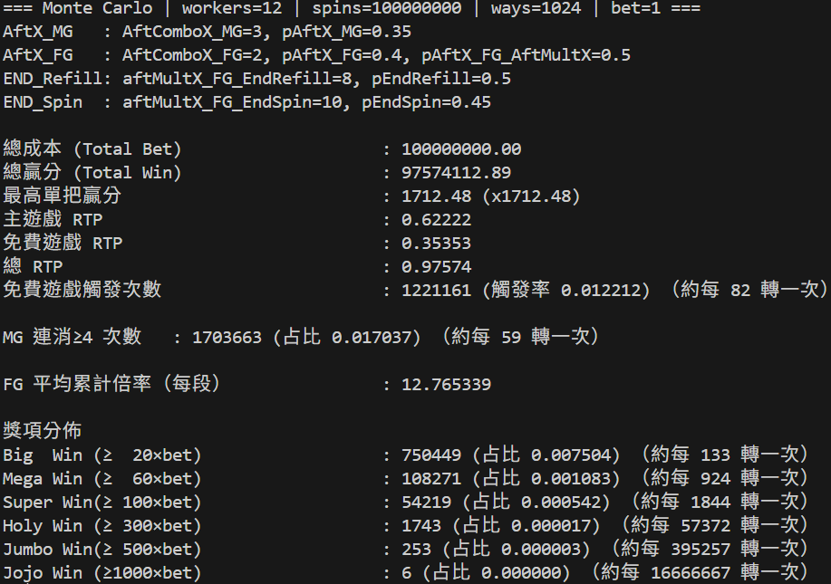

# slot_Combo_Multiplier_C++

- Slot simulator demo - Cascading Way Game

- 模擬遊戲數據，輸出各項統計資料

- 主要特色：
  - 主遊戲依每轉消除次數，當次消除贏分倍率依序x1 x2 x3 x4，後續皆x4
  - 免費遊戲依消除次數跨轉累計，當次消除贏分倍率依序x1 x2 x4 x6…至x50封頂
  - 含多個輪帶替換機制
- 遊戲規則與程式流程詳見程式檔頭註解

## 環境需求
- Windows 10/11
- C++17
  - MSVC（Visual Studio 2022）

## 開發工具(建議)
- Visual Studio Code
    - 擴充：C/C++
- Visual Studio 2022
    - 請將 專案屬性 → C/C++ → Advanced → Source and Executable Character Set 設 Use UTF-8 或在 Command Line 加 /utf-8 避免輸出亂碼

## Build
- 在「x64 Native Tools Command Prompt」或已設好 cl 的環境
    - cl /std:c++17 /O2 /EHsc /Fe:slot_Combo_Multiplier.exe slot_Combo_Multiplier.cpp

## Run (example)
- .\slot_Combo_Multiplier.exe

## 附註
- 本專案中之.cpp檔無外部依賴，迅速試跑可直接貼進VScode/VS或其他編譯軟體測試

## 模擬器輸出示意圖 完整輸出請見.txt附檔

  
   RTP、獎項分佈等主要遊戲表現

